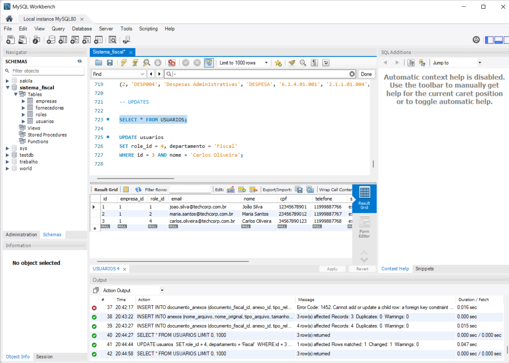
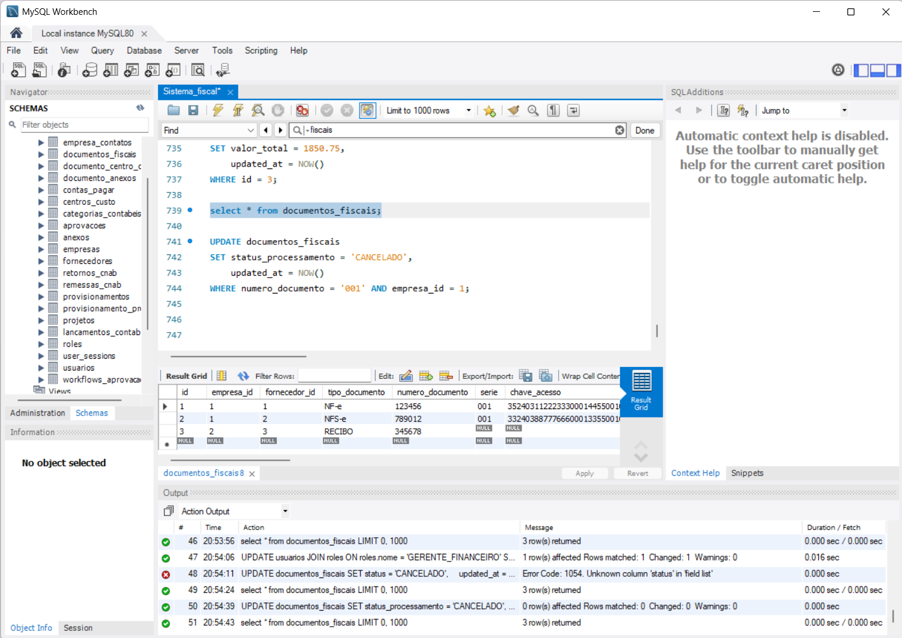
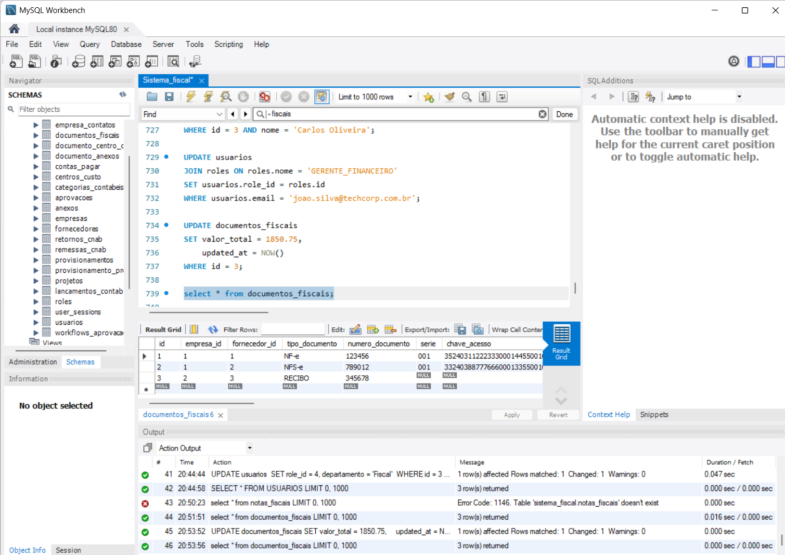
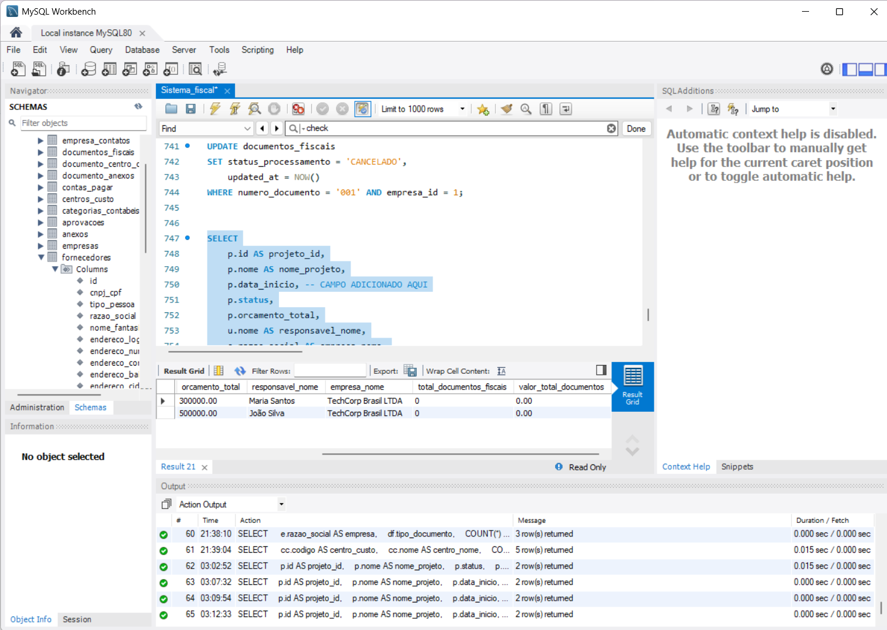
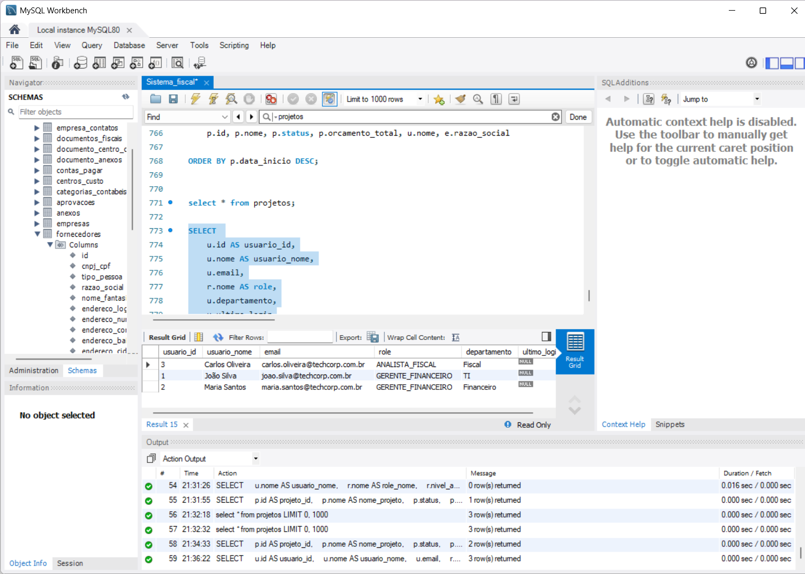
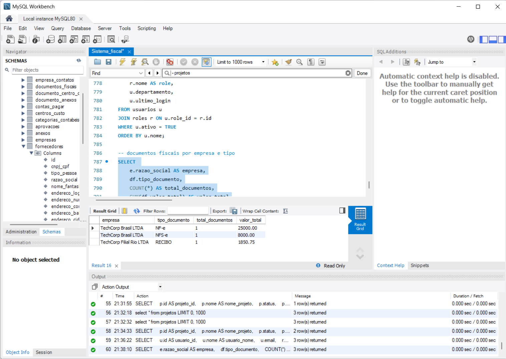
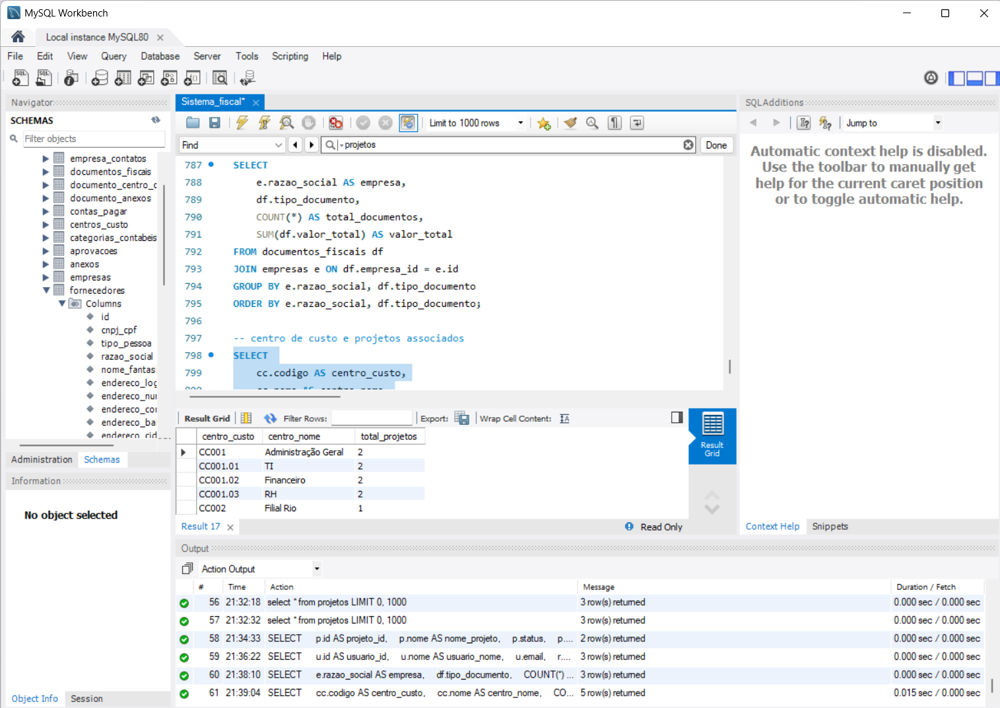

# Sistema Fiscal - Updates e Selects + adicionais

> **Sistema de Gestão Fiscal e Contábil** - Banco de dados para controle de documentos fiscais, provisionamentos, contas a pagar e lançamentos contábeis.

[👩🏽‍💻SCRIPT DO BANCO](Banco_fiscal/Sistema_fiscal.sql)

---

# Índice

1. [Visão Geral](#visão-geral)
2. [Características Principais](#características-principais)
3. [Exemplos de Inserts](#exemplos-de-inserts)

   * [Cadastro de Empresas](#cadastro-de-empresas)
   * [Usuários e Roles](#usuários-e-roles)
   * [Fornecedores](#fornecedores)
   * [Centros de Custo](#centros-de-custo)
   * [Projetos](#projetos)
   * [Documentos Fiscais Completos](#documentos-fiscais-completos)
   * [Anexos e Documentos](#anexos-e-documentos)
   * [Categorias Contábeis](#categorias-contábeis)
4. [Updates para Atualização](#updates-para-atualização)

   * [Atualizações de Usuários](#atualizações-de-usuários)
   * [Atualizações de Documentos Fiscais](#atualizações-de-documentos-fiscais)
5. [Consultas SELECT](#consultas-select)

   * [Consulta de Projetos Ativos com Documentos Associados](#consulta-de-projetos-ativos-com-documentos-associados)
   * [Consulta de Usuários Ativos](#consulta-de-usuários-ativos)
   * [Consulta de Documentos por Tipo](#consulta-de-documentos-por-tipo)
   * [Consulta de Centros de Custo e Projetos](#consulta-de-centros-de-custo-e-projetos)
6. [Conformidade OLTP e Estrutura de Qualidade](#conformidade-oltp-e-estrutura-de-qualidade)

   * [Normas Implementadas](#normas-implementadas)
   * [Segregação de Funções](#segregação-de-funções)
   * [Rastreabilidade Completa](#rastreabilidade-completa)
   * [Compliance Contábil e Fiscal](#compliance-contábil-e-fiscal)
   * [Integridade de Dados](#integridade-de-dados)
7. [Avaliação de Normalização e Trade-offs Estruturais](#avaliação-de-normalização-e-trade-offs-estruturais)

   * [Conformidade com as Primeiras Formas Normais](#conformidade-com-as-primeiras-formas-normais)
   * [Terceira Forma Normal (3NF)](#terceira-forma-normal-3nf)
   * [Requisitos de Normalização](#requisitos-de-normalização)

---

## Visão Geral

O **Sistema Fiscal** é uma solução para gestão de documentos fiscais, controle financeiro e conformidade, possuindo **22 tabelas** organizadas de acordo com seus tipos de Entidades, que constam na Documentação final completa!

## Características Principais

- **Multi-empresa**: Suporte a matriz e filiais
- **Controle de Acesso**: Sistema de roles de usuários hierárquico (5 níveis)
- **Documentos Fiscais**: NFe, NFSe, CTe, Boletos, Contratos, Nacionais, Internacions
- **Gestão Financeira**: Provisionamentos e contas a pagar
- **Contabilidade**: Lançamentos contábeis automatizados
- **Workflow**: Sistema de aprovações configurável
- **CNAB**: Integração bancária para pagamentos
- **Anexos**: Gestão de arquivos e documentos

---

## Exemplos de Inserts

### Cadastro de Empresas

```sql
-- EMPRESAS (Matriz e Filial)
INSERT INTO empresas (cnpj, razao_social, nome_fantasia, inscricao_estadual, endereco_logradouro, endereco_numero, endereco_bairro, endereco_cidade, endereco_uf, endereco_cep, email_principal, telefone_principal, empresa_matriz_id) VALUES
('11222333000144', 'TechCorp Brasil LTDA', 'TechCorp', '123456789', 'Av. Paulista', '1000', 'Bela Vista', 'São Paulo', 'SP', '01310100', 'contato@techcorp.com.br', '1133334444', NULL),
('11222333000225', 'TechCorp Filial Rio LTDA', 'TechCorp Rio', '987654321', 'Av. Copacabana', '500', 'Copacabana', 'Rio de Janeiro', 'RJ', '22070001', 'rio@techcorp.com.br', '2133334444', 1);

-- Contatos das Empresas
INSERT INTO empresa_contatos (empresa_id, tipo_contato, valor_contato, principal, observacoes) VALUES
(1, 'EMAIL', 'contato@techcorp.com.br', TRUE, 'Email principal'),
(1, 'EMAIL', 'financeiro@techcorp.com.br', FALSE, 'Email do financeiro'),
(1, 'TELEFONE', '1133334444', TRUE, 'Telefone principal'),
(1, 'WHATSAPP', '11999887766', FALSE, 'WhatsApp do João'),
(2, 'EMAIL', 'rio@techcorp.com.br', TRUE, 'Email filial Rio'),
(2, 'TELEFONE', '2133334444', TRUE, 'Telefone filial Rio');
```

### Usuários e Roles

```sql
-- Primeiro, criamos um perfil de usuário (role)
INSERT INTO roles (nome, descricao, nivel_acesso) VALUES
('ADMIN', 'Administrador do Sistema', 5),
('GERENTE_FINANCEIRO', 'Gerente Financeiro', 4),
('SUPERVISOR_CONTABIL', 'Supervisor Contábil', 3),
('ANALISTA_FISCAL', 'Analista Fiscal', 2),
('ASSISTENTE', 'Assistente Administrativo', 1);

-- Em seguida, criamos um usuário para a empresa e o vinculamos a esse perfil
INSERT INTO usuarios (empresa_id, role_id, nome, email, cpf, telefone, senha_hash, departamento) VALUES
(1, 1, 'João Silva', 'joao.silva@techcorp.com.br', '12345678901', '11999887766', 'exemplo_hash_senha_admin', 'TI'),
(1, 2, 'Maria Santos', 'maria.santos@techcorp.com.br', '23456789012', '11999887767', 'exemplo_hash_senha_gerente', 'Financeiro'),
(1, 3, 'Carlos Oliveira', 'carlos.oliveira@techcorp.com.br', '34567890123', '11999887768', 'exemplo_hash_senha_supervisor', 'Contabilidade');
```

### Fornecedores

```sql
-- Criação de Fornecedores
INSERT INTO fornecedores (cnpj_cpf, tipo_pessoa, razao_social, nome_fantasia, endereco_logradouro, endereco_numero, endereco_cidade, endereco_uf, endereco_cep, email, telefone, dados_bancarios) VALUES
('99888777000122', 'PJ', 'Fornecedor de TI LTDA', 'TechSupply', 'Rua das Flores', '123', 'São Paulo', 'SP', '01234567', 'contato@techsupply.com', '1144445555', '{"banco": "001", "agencia": "1234", "conta": "567890"}'),
('88777666000133', 'PJ', 'Serviços Contábeis ABC', 'Contábil ABC', 'Av. Brasil', '456', 'Rio de Janeiro', 'RJ', '20000000', 'contato@contabilabc.com', '2144445556', '{"banco": "237", "agencia": "5678", "conta": "123456"}'),
('12345678901', 'PF', 'José Consultor', NULL, 'Rua Consultoria', '789', 'Belo Horizonte', 'MG', '30000000', 'jose@consultor.com', '3144445557', '{"banco": "104", "agencia": "9012", "conta": "345678"}');
```

### Centros de Custo

```sql
-- Inserção de Centros de Custo definidos pela empresa ficticias
INSERT INTO centros_custo (empresa_id, codigo, nome, descricao, centro_pai_id, nivel, orcamento_mensal) VALUES
(1, 'CC001', 'Administração Geral', 'Centro de custo principal', NULL, 1, 50000.00),
(1, 'CC001.01', 'TI', 'Tecnologia da Informação', 1, 2, 20000.00),
(1, 'CC001.02', 'Financeiro', 'Departamento Financeiro', 1, 2, 15000.00),
(1, 'CC001.03', 'RH', 'Recursos Humanos', 1, 2, 10000.00),
(2, 'CC002', 'Filial Rio', 'Centro de custo da filial', NULL, 1, 30000.00);
```

### Projetos

```sql
-- Inserção de Projetos
INSERT INTO projetos (empresa_id, codigo, nome, descricao, data_inicio, data_fim_prevista, orcamento_total, responsavel_id, status) VALUES
(1, 'PROJ001', 'Modernização Sistema ERP', 'Projeto de atualização do sistema ERP', '2024-01-15', '2024-12-31', 500000.00, 1, 'ATIVO'),
(1, 'PROJ002', 'Expansão Filial Sul', 'Abertura de nova filial no Sul', '2024-03-01', '2024-08-31', 300000.00, 2, 'ATIVO'),
(2, 'PROJ003', 'Certificação ISO', 'Processo de certificação ISO 9001', '2024-02-01', '2024-10-31', 150000.00, 3, 'PLANEJAMENTO');
```

### Documentos Fiscais Completos

```sql
-- Inserção de documentos fiscais
INSERT INTO documentos_fiscais (empresa_id, fornecedor_id, tipo_documento, numero_documento, serie, chave_acesso, data_emissao, data_vencimento, data_competencia, valor_total, valor_impostos, descricao_servico_produto, uf_origem, uf_destino, usuario_criacao_id, status_processamento) VALUES
(1, 1, 'NF-e', '123456', '001', '35240311222333000144550010001234561234567890', '2024-03-15', '2024-04-15', '2024-03-01', 25000.00, 2500.00, 'Licenças de software e suporte técnico', 'SP', 'SP', 3, 'PROCESSADO'),
(1, 2, 'NFS-e', '789012', '001', '33240388777666000133550010007890121234567890', '2024-03-20', '2024-04-20', '2024-03-01', 8000.00, 800.00, 'Serviços de consultoria contábil', 'RJ', 'SP', 3, 'PROCESSADO'),
(2, 3, 'RECIBO', '345678', NULL, NULL, '2024-03-25', '2024-04-25', '2024-03-01', 5000.00, 0.00, 'Consultoria em processos', 'MG', 'RJ', 3, 'PROCESSADO');
```

### Anexos e Documentos

```sql
-- Inserção simulação com anexos
INSERT INTO anexos (nome_arquivo, nome_original, tipo_arquivo, tamanho_bytes, caminho_arquivo, hash_arquivo, uploaded_by) VALUES
('doc_001_20240315.pdf', 'nota_fiscal_123456.pdf', 'PDF', 245760, '/uploads/2024/03/doc_001_20240315.pdf', 'a1b2c3d4e5f6789012345678901234567890abcdef1234567890abcdef123456', 3),
('xml_001_20240315.xml', 'nfe_123456.xml', 'XML', 15360, '/uploads/2024/03/xml_001_20240315.xml', 'b2c3d4e5f6789012345678901234567890abcdef1234567890abcdef1234567a', 3),
('contrato_001.pdf', 'contrato_servicos_ti.pdf', 'PDF', 512000, '/uploads/2024/03/contrato_001.pdf', 'c3d4e5f6789012345678901234567890abcdef1234567890abcdef1234567ab2', 2);

INSERT INTO documento_anexos (documento_fiscal_id, anexo_id, tipo_relacao, observacoes) VALUES
(1, 1, 'PRINCIPAL', 'PDF da nota fiscal principal'),
(1, 2, 'COMPLEMENTAR', 'XML da NFe'),
(2, 3, 'CONTRATO', 'Contrato de prestação de serviços'),
(3, 1, 'COMPROVANTE', 'Comprovante do recibo');
```

### Categorias Contábeis

```sql
-- Inserção de Categorias contabeis
INSERT INTO categorias_contabeis (empresa_id, codigo, nome, tipo, conta_contabil_debito, conta_contabil_credito, natureza_despesa) VALUES
(1, 'DESP001', 'Despesas com TI', 'DESPESA', '6.1.1.01.001', '2.1.1.01.001', '339030'),
(1, 'DESP002', 'Serviços Contábeis', 'DESPESA', '6.1.2.01.001', '2.1.1.01.002', '339039'),
(1, 'DESP003', 'Consultoria', 'DESPESA', '6.1.3.01.001', '2.1.1.01.003', '339039'),
(2, 'DESP004', 'Despesas Administrativas', 'DESPESA', '6.1.4.01.001', '2.1.1.01.004', '339030');
```

---

## Updates para Atualização

### Atualizações de Usuários

```sql
-- Consulta inicial de usuários
SELECT * FROM USUARIOS;

-- Alteração de Role por ID e Nome
UPDATE usuarios 
SET role_id = 4, departamento = 'Fiscal' 
WHERE id = 3 AND nome = 'Carlos Oliveira';

-- Alteração usando JOIN com tabela de roles
UPDATE usuarios
JOIN roles ON roles.nome = 'GERENTE_FINANCEIRO'
SET usuarios.role_id = roles.id
WHERE usuarios.email = 'joao.silva@techcorp.com.br';
```


### Atualizações de Documentos Fiscais

```sql
-- Correção de valor de documento
UPDATE documentos_fiscais
SET valor_total = 1850.75,
    updated_at = NOW()
WHERE id = 3;

-- Consulta para verificar alterações
SELECT * FROM documentos_fiscais;

-- Cancelamento de documento por número
UPDATE documentos_fiscais
SET status_processamento = 'CANCELADO',
    updated_at = NOW()
WHERE numero_documento = '001' AND empresa_id = 1;
```





---

## Consultas SELECT

### Consulta de Projetos Ativos com Documentos Associados

```sql
-- Consulta de Projetos Ativos(com custos/e ou documentos ainda não alocados),Empresas relacionadas e Usuários Responsáveis
SELECT
    p.id AS projeto_id,
    p.nome AS nome_projeto,
    p.data_inicio, -- CAMPO ADICIONADO AQUI
    p.status,
    p.orcamento_total,
    u.nome AS responsavel_nome,
    e.razao_social AS empresa_nome,
    COUNT(DISTINCT df.id) AS total_documentos_fiscais,
    COALESCE(SUM(df.valor_total), 0) AS valor_total_documentos
FROM projetos p
    LEFT JOIN usuarios u ON p.responsavel_id = u.id
    INNER JOIN empresas e ON p.empresa_id = e.id
    LEFT JOIN provisionamento_projetos pp ON p.id = pp.projeto_id
    LEFT JOIN provisionamentos prov ON pp.provisionamento_id = prov.id
    LEFT JOIN documentos_fiscais df ON prov.documento_fiscal_id = df.id

WHERE p.status = 'ATIVO'

GROUP BY
    p.id, p.nome, p.data_inicio, p.status, p.orcamento_total, u.nome, e.razao_social -- ADICIONADO AO GROUP BY
ORDER BY p.data_inicio DESC;
```


### Consulta de Usuários Ativos

```sql
-- Usuários ativos na empresa
SELECT 
    u.id AS usuario_id,
    u.nome AS usuario_nome,
    u.email,
    r.nome AS role,
    u.departamento,
    u.ultimo_login
FROM usuarios u
JOIN roles r ON u.role_id = r.id
WHERE u.ativo = TRUE
ORDER BY u.nome;
```

**Usa índice**: `idx_email` na tabela usuarios



### Consulta de Documentos por Tipo

```sql
-- Documentos fiscais por empresa e tipo
SELECT 
    e.razao_social AS empresa,
    df.tipo_documento,
    COUNT(*) AS total_documentos,
    SUM(df.valor_total) AS valor_total
FROM documentos_fiscais df
JOIN empresas e ON df.empresa_id = e.id
GROUP BY e.razao_social, df.tipo_documento
ORDER BY e.razao_social, df.tipo_documento;
```
**Usa índices**:

- `idx_tipo_documento` para GROUP BY
- FK `empresa_id` para JOIN



### Consulta de Centros de Custo e Projetos

```sql
-- Centro de custo e projetos associados
SELECT 
    cc.codigo AS centro_custo,
    cc.nome AS centro_nome,
    COUNT(DISTINCT p.id) AS total_projetos
FROM centros_custo cc
LEFT JOIN projetos p ON cc.empresa_id = p.empresa_id
GROUP BY cc.id, cc.codigo, cc.nome
ORDER BY total_projetos DESC;
```
**Usa índices**:

- `idx_nome` em centros_custo
- FK `empresa_id` em ambas tabelas



---

## Conformidade OLTP e Estrutura de Qualidade

### Normas Implementadas

O sistema foi projetado seguindo os princípios do **OLTP (Online Transaction Processing)**, garantindo **alta performance**, **integridade transacional** e **consistência dos dados** em ambientes críticos de negócio.

### Segregação de Funções

- Sistema de roles hierárquico (5 níveis)
- Separação entre criação, aprovação e pagamento (enforçado por FKs de usuários)
- Auditoria completa de todas as operações

### Rastreabilidade Completa

- Timestamps automáticos em todas as tabelas (`created_at`, `updated_at`)
- Referência de usuário em todas as operações
- Histórico de aprovações e rejeições (tabela `aprovacoes`)
- Hash de arquivos para garantir integridade e rastreabilidade (tabela `anexos`)

### Compliance Contábil e Fiscal

- Lançamentos contábeis automáticos (baseado em `provisionamentos`)
- Integração com documentos fiscais oficiais (NF-e, NFS-e, CTe)
- Controle de competência contábil (`data_competencia`)
- Padronização de campos (CNPJ, CPF, valores monetários)

### Integridade de Dados

- Chaves estrangeiras com **cascata controlada** (uso estratégico de `RESTRICT`, `CASCADE`, `SET NULL`)
- Índices únicos em campos críticos (CNPJ, CPF, chave de acesso da NF-e)
- Validação de documentos fiscais no momento da inserção (via `UNIQUE` em `chave_acesso`)

---

## Avaliação de Normalização e Trade-offs Estruturais

O modelo de dados do **Sistema Fiscal** foi conscientemente projetado para atingir o nível da **Terceira Forma Normal (3NF)**, optando por compromissos estratégicos em pontos específicos para priorizar a **flexibilidade** e a **eficiência de leitura (performance)**.

### Conformidade com as Primeiras Formas Normais

#### Segunda Forma Normal (2NF)
- **Status:** Totalmente cumprida  
- **Observação:** Não há dependências parciais; todos os atributos não-chave dependem da chave primária inteira.

#### Primeira Forma Normal (1NF) e JSON (Violação Intencional)
- **Status:** Violada intencionalmente  
- **Campos Impactados:** 
  - `dados_bancarios` (em `fornecedores`)  
  - `permissoes_base` (em `roles`)  
- **Justificativa:** A violação é aceita para **ganhar flexibilidade estrutural**, permitindo a adição de novas contas bancárias ou permissões sem alterar o esquema do banco de dados.

### Terceira Forma Normal (3NF)

O modelo **não atende estritamente à 3NF** devido à **denormalização seletiva** em campos de cadastro, visando **velocidade** em detrimento da redundância zero.

#### Violação de Endereços (Dependência Transitiva)
- **Campos Impactados:** `endereco_cidade`, `endereco_uf`, etc. (em `empresas` e `fornecedores`)  
- **Natureza da Violação:** Esses campos são transitivamente dependentes de um atributo não-chave (`CEP`).  
- **Justificativa:** Mantê-los aqui é um **trade-off de performance**, evitando JOINs constantes em consultas de leitura e otimizando a apresentação de cadastros.

### Requisitos de Normalização

#### Correção para 3NF Completa
- **Ação Necessária:** Mover os campos `endereco_*` de `empresas` e `fornecedores` para uma **nova tabela `ENDERECOS`** e vincular via **chave estrangeira**.  

#### Benefício Estrutural
- O uso extensivo de **Chaves Estrangeiras (FKs)** com `ON DELETE RESTRICT/CASCADE` (nas tabelas de provisão e fluxo) garante:
  - Que as transações financeiras sejam **rastreadas**  
  - Que dados cruciais **nunca sejam deletados**, mantendo a **Integridade Transacional**

---
*Esta documentação serve como referência para desenvolvedores, administradores de banco de dados e usuários do Sistema Fiscal que estejam explorando este projeto.*

[📑 Documentação Completa](Banco_fiscal/Banco_Doc_Final.pdf)

---
